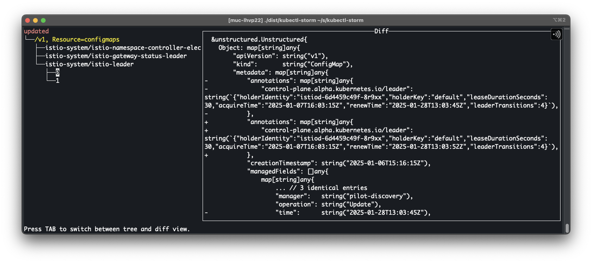

# kubectl-storm


This `kubectl` plugin aim to detect and report a storm of changes on some resources in a Kubernetes cluster.

This happens when a resource is updated multiple times in a short period of time, which can be a sign of a misbehaving controller or a human error.

## Installation

### Krew

```bash
kubectl krew install storm
```

### Releases

Download the latest release from the [releases page](https://github.com/guilhem/kubectl-storm/releases).

## Usage

```bash
kubectl storm --generation-changes=5 --run-duration=1m
```

## Example



## License

[APACHE 2.0](LICENSE)
