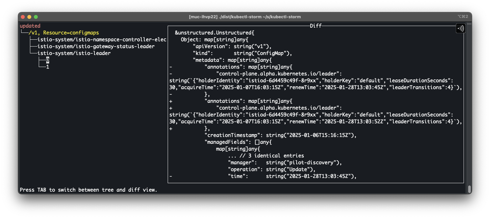

# kubectl-storm


This `kubectl` plugin aims to detect and report a storm of changes on Kubernetes resources.

This happens when a resource is updated multiple times in a short period of time, which can be a sign of a misbehaving controller or a human error.

By default, `kubectl-storm` observes `metadata.resourceVersion`, so it reports write storms including status and metadata updates. Use `--signal=generation` to focus on `metadata.generation` changes, which normally reflect spec changes.

## Installation

### Krew

```bash
kubectl krew install storm
```

### Releases

Download the latest release from the [releases page](https://github.com/guilhem/kubectl-storm/releases).

## Usage

```bash
kubectl storm --change-threshold=5 --run-duration=1m
kubectl storm --signal=generation --change-threshold=5 --run-duration=1m
kubectl storm --include-resource=apps/v1/deployments --exclude-resource=core/v1/events
```

`--generation-changes` is still accepted as a deprecated alias for `--change-threshold`.

## Example



## License

[APACHE 2.0](LICENSE)
